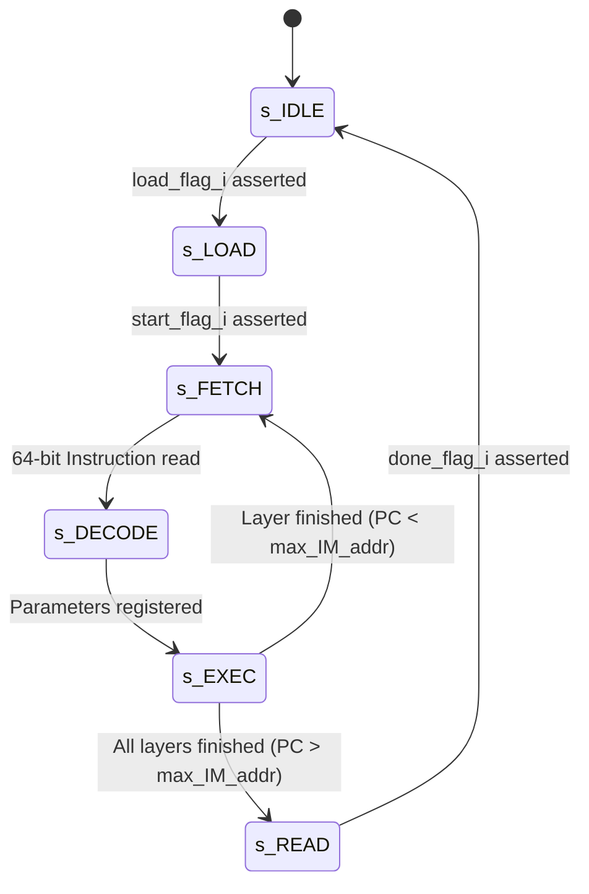

# Hardware Architecture & Micro-Instruction Specification

This document provides the microarchitectural specification, datapath design, memory hierarchy, and 64-bit micro-instruction format for the synthesizable 1D-CNN AI Accelerator core (`CNN_1D_Core`), tailored for single-channel EEG seizure detection on the **AMD-Xilinx Kria KV260 / KR260 (Zynq UltraScale+)**.

---

## 1. Top-Level Core Architecture

The accelerator follows an **Instruction-Driven, Output-Stationary (OS)** microarchitecture designed to execute 1D convolutions (Standard, Depthwise-Separable, Pointwise) and dense linear projections with zero external DRAM traffic.

```text
                                  +-----------------------+
                                  |   AXI4-Lite / DMA     |
                                  |   (Host ARM PS / SoC) |
                                  +-----------+-----------+
                                              |
                     +------------------------+------------------------+
                     |                        |                        |
             +-------v-------+        +-------v-------+        +-------v-------+
             |  Instruction  |        |  Weight/Bias  |        |  Ping-Pong FM |
             | Memory (IMEM) |        | Memory Banks  |        | Memory (16 Bk)|
             +-------+-------+        +-------+-------+        +-------+-------+
                     |                        |                        |
             +-------v-------+                |                        |
             |   Controller  |                |                        |
             |   (FSM & PC)  |                |                        |
             +-------+-------+                |                        |
                     | Control Signals        |                        |
                     +----------------+       |                        |
                                      |       | Weights                | IFM Stream
                                      v       v                        v
                               +------------------------------------------------+
                               |              Sliding Line Buffer               |
                               +-----------------------+------------------------+
                                                       | Multi-tap Samples
                                                       v
                               +------------------------------------------------+
                               |     Output-Stationary PE Array (4 x 16)        |
                               |    48-bit Local Accumulators + Multipliers     |
                               +-----------------------+------------------------+
                                                       | Full-Precision OFMAP
                                                       v
                                +------------------------------------------------+
                                |     Fixed-Point Quantizer / Saturator (INT16)  |
                                +-----------------------+------------------------+
                                                        | Re-quantized Output
                                                        +--------> (Write back to FM Bank)
```

### Module Hierarchy

* **`CNN_1D_Core.v`** (Top-Level Accelerator Core Wrapper)
  * **`Instruction_Memory.v`**: Dual-port on-chip BRAM storing 64-bit layer configuration instructions.
  * **`Controller.v`**: Central FSM, Program Counter (PC), layer address generator, and execution scheduler.
  * **`Line_Buffer.v`**: Multi-tap sliding window buffer supporting causal streaming and dilated taps.
  * **`PEA.v` (Processing Element Array)**: 2D computation matrix organized as $4 \text{ rows} \times 16 \text{ columns} = 64\text{ PEs}$.
    * **`PE.v`**: Individual processing element containing a 2-stage pipelined multiplier and local 48-bit accumulator.
    * **`Fixed_Point_Multiplier.v`**: 16x16-bit signed fixed-point multiplication engine.
  * **`Ping_Pong_FMAP_Bank_Memory.v`**: 16 interleaved SRAM banks for input/output feature maps.
  * **`Weight_Bank_Memory.v`** & **`Bias_Bank_Memory.v`**: Dedicated on-chip storage for kernel parameters.
  * **`Fixed_Point_Quantizer.v`**: Barrel shifter, rounding logic, and saturation clamp back to INT16 (`[-32768, 32767]`).
  * **`Global_Arbiter.v` & `IFM_Arbiter.v`**: Memory bus arbiters managing host AXI access and internal datapath access.

---

## 2. 64-bit Micro-Instruction Architecture

The accelerator eliminates host CPU polling by fetching micro-instructions sequentially from `Instruction_Memory`. Each 64-bit instruction fully defines the parameters for a single convolutional or pooling layer.

### Micro-Instruction Bitfield Mapping (`instruction_i [63:0]`)

```text
 63      60 59   58 57       48 47       38 37    34 33    32 31    28 27      22 21          12 11     5 4   3 2 1 0
+----------+-------+-----------+-----------+--------+--------+--------+----------+--------------+--------+-----+---+---+
| DILATION | CONV  |   IN_CH   |  OUT_CH   | KERNEL | STRIDE |  PAD   | OUT_SHIFT| SRC_FM_BASE  |RESERVED|P_UP |R|S|D|
|  [63:60] | [59:58|  [57:48]  |  [47:38]  | [37:34]| [33:32]| [31:28]| [27:22]  |   [21:12]    | [11:5] |[4:3]|2|1|0|
+----------+-------+-----------+-----------+--------+--------+--------+----------+--------------+--------+-----+---+---+
```

### Bitfield Descriptions

| Bitfield | Width | Name | Description & Encodings |
| :--- | :---:| :--- | :--- |
| **`[63:60]`** | 4 | `DILATION` | Dilation rate for temporal sampling:<br>• `4'd0`: Dilation = 1 (Standard adjacent sampling)<br>• `4'd1`: Dilation = 2<br>• `4'd2`: Dilation = 4<br>• `4'd3`: Dilation = 8<br>• `4'd4`: Dilation = 16 |
| **`[59:58]`** | 2 | `CONV_MODE` | Computation datapath configuration:<br>• `2'b00` (`CONV_STANDARD`): Standard Conv1D, Pointwise ($K=1$), or Dense Linear Classifier.<br>• `2'b01` (`CONV_DEPTHWISE`): Depthwise Separable 1D Convolution (`groups = in_channels`).<br>• `2'b10`: Global Average Pooling (GAP) / Elementwise Bypass mode.<br>• `2'b11`: Reserved. |
| **`[57:48]`** | 10 | `IN_CH` | Number of input channels (Supports 1 to 1024 channels). |
| **`[47:38]`** | 10 | `OUT_CH` | Number of output channels (Supports 1 to 1024 channels). |
| **`[37:34]`** | 4 | `KERNEL` | Kernel size $K$ ($1 \le K \le 15$):<br>• `4'd1`: $K=1$ (Pointwise / Linear)<br>• `4'd5`: $K=5$ (Main blocks B1–B4, Context)<br>• `4'd7`: $K=7$ (Stem layer) |
| **`[33:32]`** | 2 | `STRIDE_MODE` | Stride step size along temporal dimension:<br>• `2'b00`: Stride = 1 (No decimation)<br>• `2'b01`: Stride = 2 (Decimate temporal dimension by $2\times$) |
| **`[31:28]`** | 4 | `PAD` | Lower 4 bits of zero-padding applied to each boundary ($0 \le P \le 15$). |
| **`[27:22]`** | 6 | `OUTPUT_SHIFT` | Fixed-point right-shift scaling factor ($0 \le \text{shift} \le 63$) for INT8 / DFP8 requantization (symmetric round-to-nearest arithmetic shift). |
| **`[21:12]`** | 10 | `SRC_FM_BASE` | Base word address of input feature map within the source memory bank. |
| **`[11:5]`** | 7 | `RESERVED` | Reserved for future acceleration flags (e.g., ReLU6, MaxPool). |
| **`[4:3]`** | 2 | `PAD_UPPER` | Upper 2 bits of zero-padding when $P > 15$ ($P = \{\text{PAD\_UPPER}, \text{PAD}\}$ supports up to $P=63$). |
| **`[2]`** | 1 | `RELU_EN` | Fused Activation control:<br>• `1'b1`: Fused ReLU enabled (`max(0, x)` after quantization).<br>• `1'b0`: Linear / Bypass (no ReLU applied). |
| **`[1]`** | 1 | `SRC_FM_SEL` | Source buffer selection: `0`: Ping Bank, `1`: Pong Bank. |
| **`[0]`** | 1 | `DST_FM_SEL` | Destination buffer selection: `0`: Ping Bank, `1`: Pong Bank. |

---

## 3. Computation Engine: Output-Stationary (OS) PE Array

### Why Output-Stationary Dataflow?

In 1D streaming networks with deep channel dimensions, reading and writing intermediate partial sums to memory creates severe bandwidth contention and consumes excessive power. Under the **Output-Stationary (OS)** paradigm:
1. An output feature map pixel remains stationary inside a PE's **48-bit accumulator register**.
2. Inputs and weights are streamed into the PE across all relevant input channels and kernel taps.
3. Only when the complete dot product across all input channels and temporal taps is resolved is the final sum passed to the quantizer and written back to memory **exactly once**.

### PE Array Organization ($4 \text{ Rows} \times 16 \text{ Columns}$)

* **16 Spatial Columns:** Each clock cycle, 16 adjacent temporal points are evaluated concurrently.
* **4 Channel Rows:**
  * **In Standard / Pointwise Mode:** 4 independent output channels are evaluated in parallel ($4 \text{ channels} \times 16 \text{ temporal points} = 64\text{ MACs/cycle}$).
  * **In Depthwise Mode:** Channels are mapped 1:1 to spatial lanes, with lane masks disabling unused rows.

---

## 4. Sliding Line Buffer & Dilation Taps

The sliding line buffer eliminates redundant BRAM reads by maintaining a local shift register of temporal samples:

$$\text{Line Buffer Length} = (K - 1) \times Dilation + 1$$

* When streaming in new samples, old samples shift forward by 1 position per cycle.
* Multi-tap addresses select samples at stride offsets:
  * For $Dilation = 1$: Taps at indices `[0, 1, 2, 3, 4]`.
  * For $Dilation = 2$: Taps at indices `[0, 2, 4, 6, 8]`.
  * For $Dilation = 16$: Taps at indices `[0, 16, 32, 48, 64]`.

Each sample is fetched from BRAM **only once**, yielding optimal energy efficiency.

---

## 5. Memory Subsystem & Ping-Pong Banking

* **Interleaved 16-Bank Feature Map Memory:** 16 independent dual-port SRAM banks permit 16 continuous samples to be read or written simultaneously in a single clock cycle without bank address collisions.
* **Ping-Pong Buffer Mechanism:**
  * During Layer $N$: Bank A (Ping) acts as Read Source (`SRC_FM_SEL=0`), Bank B (Pong) acts as Write Destination (`DST_FM_SEL=1`).
  * During Layer $N+1$: Bank B becomes Read Source (`SRC_FM_SEL=1`), Bank A becomes Write Destination (`DST_FM_SEL=0`).
  * No memory copy is needed between layers; role reversal is handled entirely via pointer swapping.

### Ping-Pong Memory Depth & Sizing Specification

To support autonomous, seamless layer-by-layer execution without external memory spills, each buffer partition (Ping or Pong) must accommodate at least the **maximum feature map size** produced across all network layers:

1. **Maximum Layer Output Size Determination:**
   * `stem.0` output: $8 \text{ channels} \times 512 \text{ samples} = \mathbf{4,096\text{ elements}}$ ($8,192\text{ Bytes}$ at 16-bit word size)
   * `b1.pointwise` output: $16 \text{ channels} \times 256 \text{ samples} = \mathbf{4,096\text{ elements}}$ ($8,192\text{ Bytes}$ at 16-bit word size)
   * *(Note: Later stages shrink along time, e.g., `b2.pointwise` produces $24 \times 128 = 3,072\text{ elements}$, `b3.pointwise` produces $32 \times 64 = 2,048\text{ elements}$).*
   * Therefore, the **global peak feature map footprint across all layers is 4,096 elements (4,096 16-bit words = 8 KiB)**.

2. **Bank Depth Calculation (`MEM_AWIDTH`):**
   * Across **16 physical banks** (`NBANKS = 16`), with each bank storing 16-bit data words (`DWIDTH = 16`):
     $$\text{Required Depth per Bank} = \frac{\text{Max Output Elements}}{\text{Number of Banks}} = \frac{4,096\text{ words}}{16\text{ Banks}} = \mathbf{256\text{ words / bank}}$$
   * For 16-bit activations (INT16 / DFP16), the **theoretical minimum address width** is:
     $$\text{MEM\_AWIDTH}_{\min} = \lceil \log_2(256) \rceil = \mathbf{8\text{ bits}}$$

3. **Current RTL Configuration vs. Area Optimization:**
   * **Current Baseline (`MEM_AWIDTH = 10`):** Allocates $2^{10} = 1,024$ words per bank ($16 \times 1,024 = 16,384$ 16-bit words per buffer partition). This provides a **$4\times$ headroom margin**, allowing arbitrary padding extension and compatibility with wider experimental model variants without BRAM overflow.
   * **Area-Optimized Mode (`MEM_AWIDTH = 8`):** Can be tightened directly to 8 bits for production ASIC/FPGA implementation, saving **75% of Block RAM** allocated to the Ping-Pong subsystem while still perfectly containing the 4,096-element peak activation tensor.

---

## 6. Controller Finite State Machine (FSM)

The controller orchestrates execution across six states:



1. **`s_IDLE`**: Core held in reset or waiting for host configuration.
2. **`s_LOAD`**: Host CPU streams weights, biases, and instructions into on-chip BRAM via AXI.
3. **`s_FETCH`**: Controller increments PC and reads 64-bit instruction from `Instruction_Memory`.
4. **`s_DECODE`**: Micro-instruction fields decoded into layer parameters (Kernel, Stride, Dilation, Channels).
5. **`s_EXEC`**: PE array executes convolution over all channels and temporal tiles until `layer_done_r`.
6. **`s_READ`**: Core asserts `complete_o`, enabling host CPU/DMA to read the final 2 classification logits.
